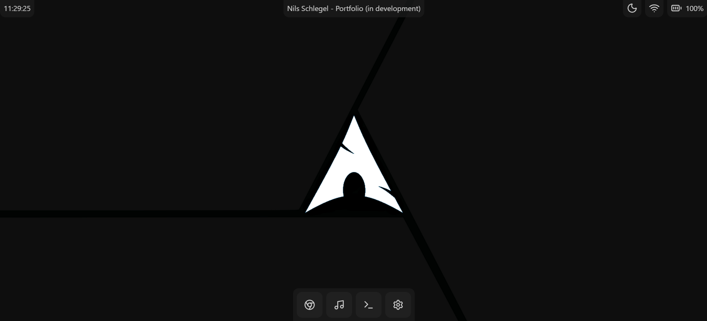
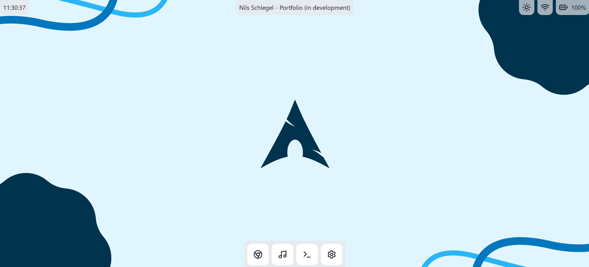

# Portfolio Website

_A modern, Arch Linux inspired personal portfolio built with SvelteKit_

<p>
  <a href="https://github.com/nijasc/nilsschlegel.dev/stargazers">
    
  </a>
  <a href="https://github.com/nijasc/nilsschlegel.dev/network/members">
    
  </a>
  <a href="https://github.com/nijasc/nilsschlegel.dev/commits/main">
    
  </a>
  
  
</p>

A clean, fast-loading portfolio optimized for readability, accessibility, and smooth interactions. The visual language takes cues from Arch Linux: crisp contrast, restrained color, and purposeful motion without sacrificing performance.

## Contents

- [Overview](#overview)
- [Screenshots](#screenshots)
- [Tech Stack](#tech-stack)
- [Getting Started](#getting-started)
- [Project Status](#project-status)
- [Contributing](#contributing)
- [Contact](#contact)
- [License](#license)

## Overview

This repository contains the source code for my personal portfolio. It highlights work, writing, and experiments in a focused layout with thoughtful animations and robust dark/light theme support.

Key qualities:

- Fast by default: minimal JS, image optimization, and route-level code splitting
- Accessible: semantic markup, keyboard friendly interactions, and contrast checked colors
- Maintainable: clear structure, typed endpoints, and a small, well chosen toolkit

## Screenshots

<p>
  
  
</p>

## Tech Stack

- Framework: SvelteKit
- UI: Tailwind CSS, DaisyUI
- Icons: Lucide (Lucide-Svelte)
- Motion: GSAP

## Getting Started

```bash
git clone https://github.com/nijasc/nilsschlegel.dev.git
cd nilsschlegel.dev
bun i
bun run dev
```

Visit http://localhost:5173 (or the URL shown in your terminal).

## Project Status

- Current version: 1.0.0
- Roadmap: content expansion, tighter motion guidelines, and minor UX refinements
- Issues and feature requests: please use GitHub Issues

## Contributing

Contributions are welcome. If you are proposing a notable change, open an issue first to discuss the approach. For pull requests:

- Keep changes focused and documented
- Follow existing code style and conventions
- Include before/after context for UI changes (screens or gifs)

## Contact

- Website: https://nilsschlegel.dev
- GitHub: https://github.com/nijasc
- LinkedIn: https://www.linkedin.com/in/nils-schlegel-470527382/
- Email: me@nilsschlegel.dev

## License

[MIT](LICENSE)
